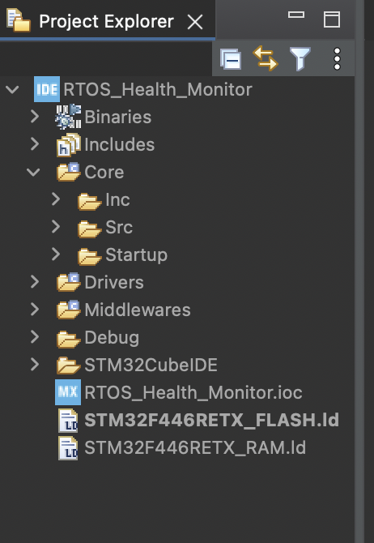
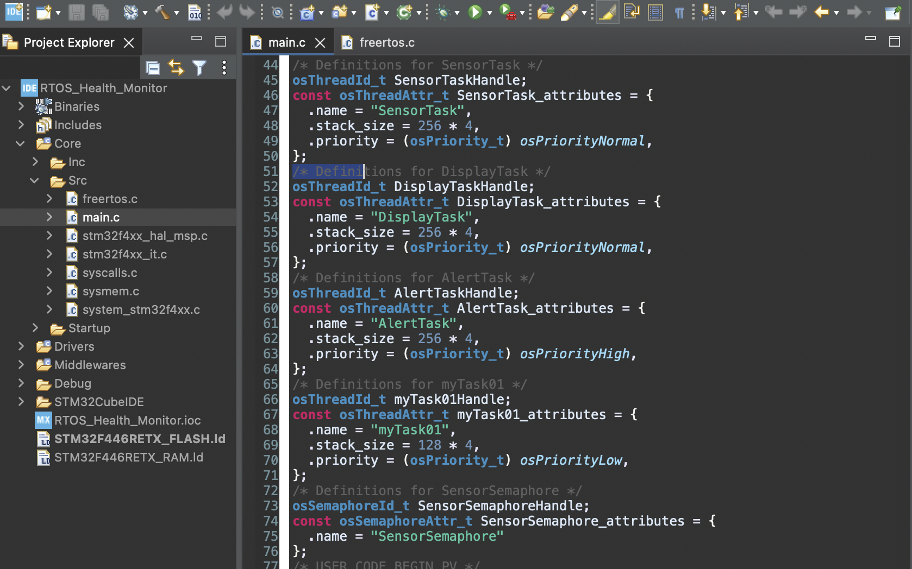
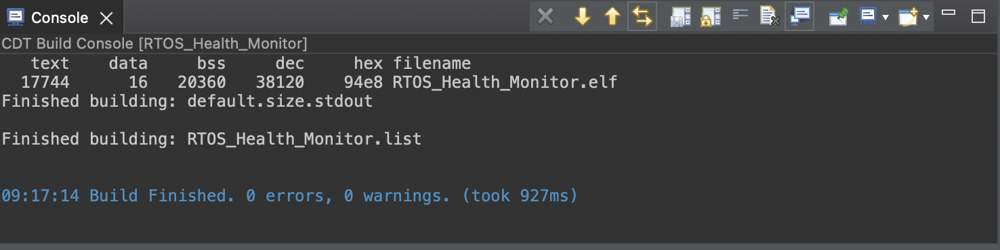

# RTOS Health Monitoring Sensor Hub

A FreeRTOS-based health monitoring firmware project developed on STM32F446RE using STM32CubeIDE.

## Features

- FreeRTOS Multitasking Architecture
- Sensor Data Acquisition Task
- Display Management Task
- Alert Monitoring Task
- Queue-Based Inter-Task Communication
- Modular Firmware Structure
- STM32 HAL Driver Integration

## Technologies Used

- Embedded C
- STM32F446RE
- FreeRTOS
- STM32CubeIDE
- STM32 HAL
- Git & GitHub

## Project Structure

```text
Firmware/
└── RTOS_Health_Monitor
    ├── Core
    ├── Drivers
    ├── Middlewares
    ├── STM32CubeIDE
    └── RTOS_Health_Monitor.ioc
```

## FreeRTOS Tasks

- SensorTask
  - Acquires sensor data periodically.

- DisplayTask
  - Processes and displays acquired data.

- AlertTask
  - Monitors thresholds and generates alerts.

## Screenshots

### Project Structure


### FreeRTOS Tasks


### Build Success


## Build Status

Successfully compiled in STM32CubeIDE.

```text
Build Finished
0 Errors
0 Warnings
```

## Future Enhancements

- UART-based live monitoring
- OLED/LCD integration
- Real sensor integration (MAX30102 / MPU6050)
- Data logging support

## License

This project is released under the MIT License.
